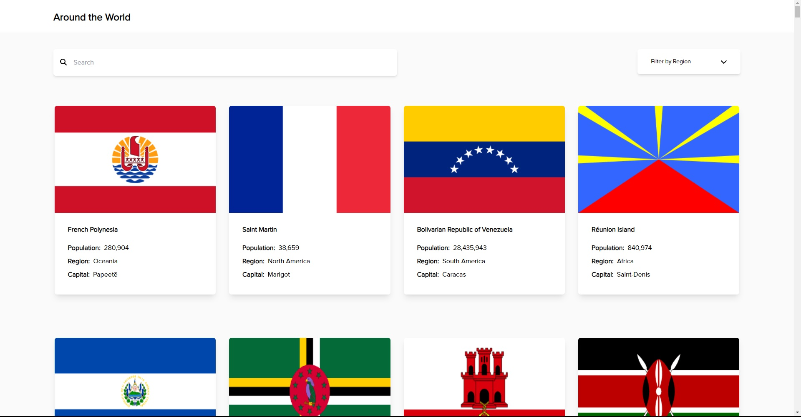
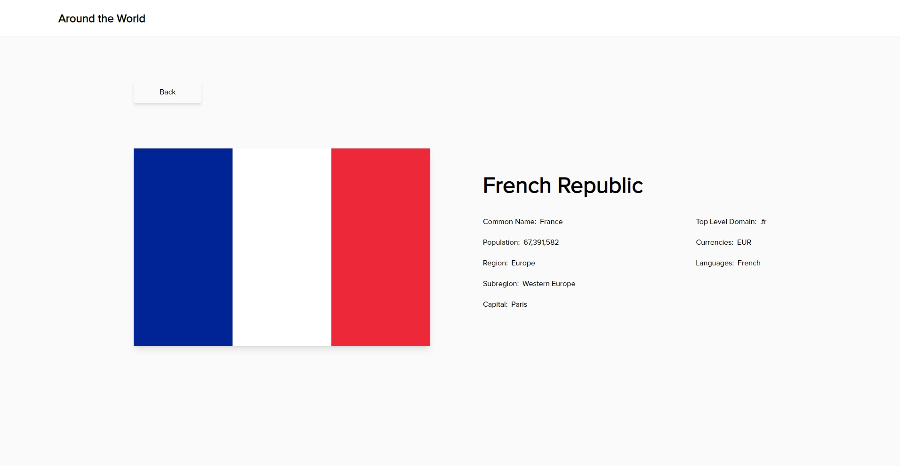
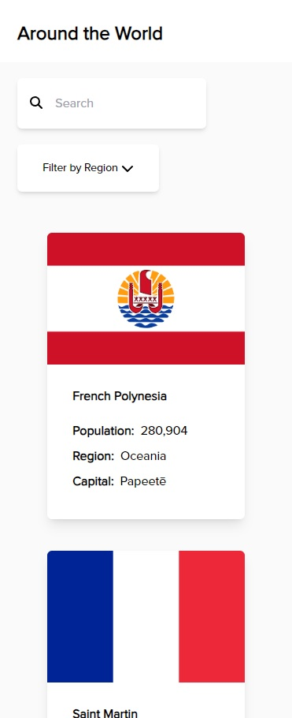
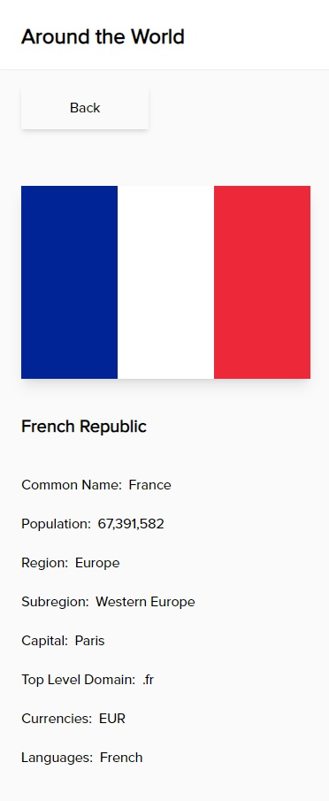
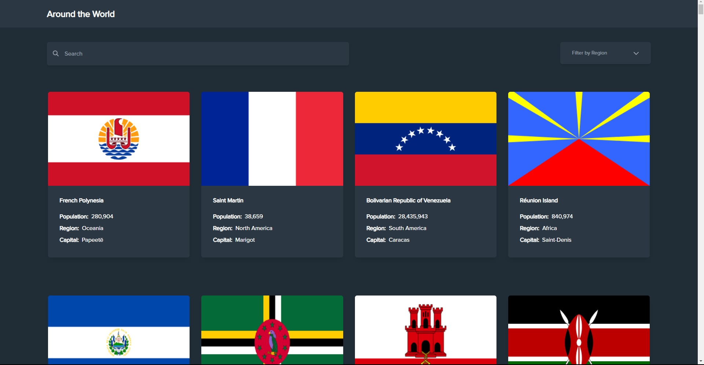
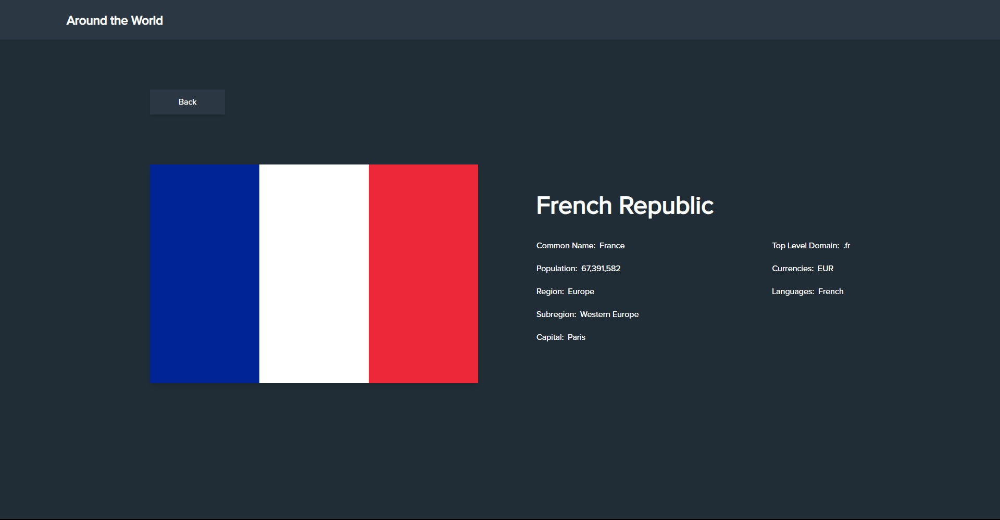
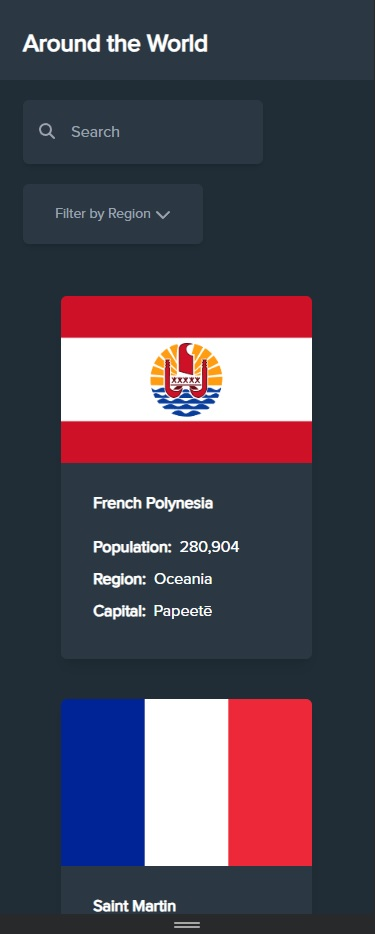
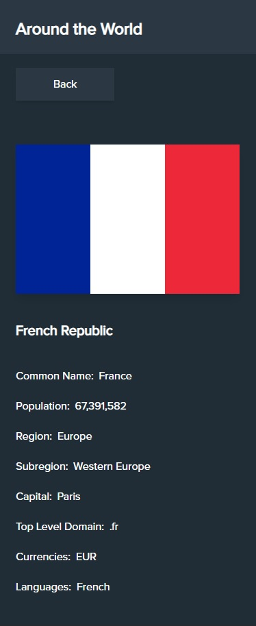

# Around the World - REST Countries API with adaptive color theme project

This is a project created with reference to the [REST Countries API with color theme switcher challenge on Frontend Mentor](https://www.frontendmentor.io/challenges/rest-countries-api-with-color-theme-switcher-5cacc469fec04111f7b848ca).

## Table of contents

- [Around the World - REST Countries API with adaptive color theme project](#around-the-world---rest-countries-api-with-adaptive-color-theme-project)
  - [Table of contents](#table-of-contents)
  - [Overview](#overview)
    - [The challenge](#the-challenge)
    - [Screenshot](#screenshot)
    - [Links](#links)
  - [My process](#my-process)
    - [Built with](#built-with)
    - [Continued development](#continued-development)
    - [Useful resources](#useful-resources)
  - [Author](#author)

**Note: Delete this note and update the table of contents based on what sections you keep.**

## Overview

### The challenge

Users should be able to:

- See all countries from the API on the homepage
- Search for a country using an `input` field
- Filter countries by region
- Click on a country to see more detailed information on a separate page

### Screenshot

### Links

- Live Site URL: [Around-the-world](https://around-the-world-kappa.vercel.app)

## My process

### Built with

- Semantic HTML5 markup
- Mobile-first workflow
- [React](https://reactjs.org/) - JS library
- [Tailwind CSS](https://tailwindcss.com) - Utility-first CSS framework

### Continued development

Develop more projects while maintaining the use of:

- Responsive Design
- Utilizing Hooks
- Custom Hooks
- React Redux

### Useful resources

- [Tailwind CSS Documentation](https://tailwindcss.com/docs/installation) - Really helpful documentation to utilize Tailwind properly. Will use it more from time to time
- [React.js Documentation](https://react.dev/reference/react) - Looking on React JS documentation saves more time than searching the problems you might encounter.

## Author

- LinkedIn - [Don Alec Eugenio](https://www.linkedin.com/in/daeugenio/)
